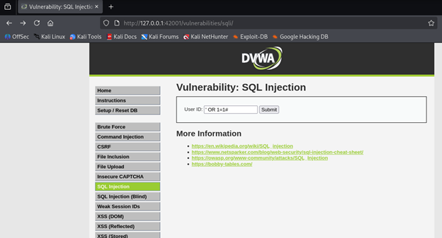
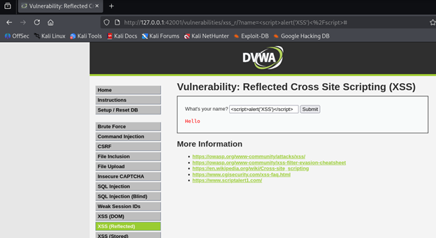

# Burp Suite Web Application Testing Lab
**Web App Pentesting | Traffic Interception | SQLi | XSS | Defender Analysis**

> Hands-on web application penetration testing lab using Burp Suite Community Edition to intercept HTTP traffic and exploit SQL Injection and XSS vulnerabilities in DVWA — mapping techniques to MITRE ATT&CK.

---

## Lab Environment

| Component | Details |
|---|---|
| **Testing Tool** | Burp Suite Community Edition |
| **Target** | DVWA (Damn Vulnerable Web Application) |
| **Platform** | Kali Linux (VM) |
| **DVWA URL** | http://127.0.0.1:42001 |
| **Network** | Localhost only — isolated |

> ⚠️ All testing performed against a locally hosted intentionally vulnerable application. No live systems were targeted.

---

## Objectives

- Configure Burp Suite as a proxy to intercept browser traffic
- Capture and inspect raw HTTP requests
- Exploit SQL Injection to extract database contents
- Exploit Reflected XSS to execute injected JavaScript
- Map findings to MITRE ATT&CK and document defender controls

---

## Setup

### Start DVWA
```bash
sudo apt install dvwa -y
sudo dvwa-start
```
Open `http://127.0.0.1:42001` → login: `admin / password` → set Security Level to **Low**.

### Configure Burp Proxy
1. Burp Suite → **Proxy > Intercept** → Intercept ON
2. Firefox → Settings → Network Settings → Manual proxy → `127.0.0.1:8080`

---

## Attack 1 — SQL Injection

### What it is
User input inserted directly into a SQL query without sanitisation — attacker manipulates query logic to extract data.

### Steps
1. DVWA → **SQL Injection**
2. Burp Intercept ON → submit `1` → observe raw GET request in Burp → Forward


3. Intercept OFF → test payloads in DVWA input:

```sql
-- Always-true condition
' OR 1=1#

-- Extract all users
1' OR '1'='1' --
```

### Result
All 5 user records returned: admin, Gordon Brown, Hack Me, Pablo Picasso, Bob Smith — no sanitisation applied.




---

## Attack 2 — Reflected XSS

### What it is
Unsanitised user input reflected back in the HTML response and executed as JavaScript in the victim's browser.

### Steps
1. DVWA → **XSS (Reflected)**
2. Submit in the name field:

```html
<script>alert('XSS')</script>
```

### Result
Alert box fired — script executed immediately with no encoding or sanitisation.




---

## Findings

| Attack | Vulnerability | Location | Severity | Result |
|---|---|---|---|---|
| SQL Injection | Unsanitised SQL query | `/vulnerabilities/sqli/` | Critical | All user credentials extracted |
| Reflected XSS | Unsanitised input reflected in HTML | `/vulnerabilities/xss_r/` | High | Script executed in browser |

---

## MITRE ATT&CK Mapping

| Tactic | Technique | ID |
|---|---|---|
| Initial Access | Exploit Public-Facing Application | T1190 |
| Credential Access | Exploitation for Credential Access | T1212 |
| Credential Access | Unsecured Credentials in Database | T1552.001 |
| Collection | Data from Information Repositories | T1213 |
| Execution | Client-Side Script Execution (XSS) | T1059.007 |
| Collection | Session Hijacking via Cookie Theft | T1539 |

---

## Defender Takeaways

### SQL Injection — Prevention
| Control | How It Helps |
|---|---|
| **Parameterised Queries** | Input never concatenated into SQL — eliminates SQLi entirely |
| **Input Validation** | Reject special characters (`'`, `--`, `;`) at the application layer |
| **Least Privilege DB accounts** | App DB user only has SELECT on required tables |
| **WAF** | Detects and blocks SQLi patterns in HTTP requests |
| **Error Handling** | Never return raw SQL errors — reveals DB structure |

### XSS — Prevention
| Control | How It Helps |
|---|---|
| **Output Encoding** | Encode `<`, `>`, `"`, `'` before rendering user input as HTML |
| **Content Security Policy (CSP)** | HTTP header blocking inline script execution |
| **HttpOnly Cookie Flag** | Prevents JavaScript from reading session cookies |
| **Input Sanitisation** | Strip or reject HTML tags from user input |
| **WAF** | Detects `<script>` patterns in HTTP parameters |

### SOC Detection
| Signal | Detection Logic |
|---|---|
| **SQLi in logs** | URL params containing `'`, `UNION SELECT`, `OR 1=1` |
| **XSS in logs** | `<script>`, `alert(`, `document.cookie` in HTTP params |
| **Abnormal response sizes** | Full table dumps return much larger responses than normal |
| **WAF alerts** | ModSecurity / AWS WAF rules fire on both signatures |

---

## Academic & Professional Context

- **OWASP Top 10** — A03: Injection, A07: Cross-Site Scripting
- **CompTIA Security+ SY0-701** — Domain 2.3: Application vulnerabilities
- **CompTIA PenTest+ PT0-002** — Domain 3: Web application attacks
- **eWPT / BSCP** — Core web app pentesting methodology

---

## Status

- [x] DVWA installed and running on Kali
- [x] Burp Suite proxy configured
- [x] HTTP request intercepted and inspected
- [x] SQL Injection — all 5 users extracted
- [x] XSS payload executed — alert confirmed
- [x] Screenshots captured and pushed
- [x] Findings documented and MITRE mapped
